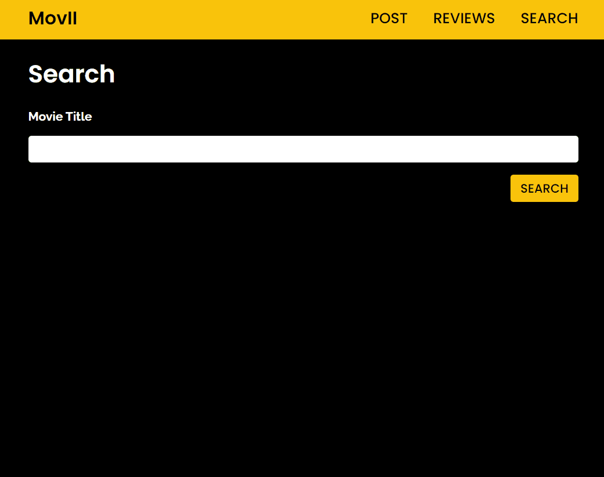

# movII

A dynamic HTML, CSS, and JavaScript project for movie fans that want to write movie reviews.

movII was created for movie fans that want to keep a journal of all the reviews they have written. Reviews can be subjective and although there are reputable websites with professional critic reviews, sometimes fans want to form their opnion on the movies they've watched.

## Technologies Used

- JavaScript
- HTML5
- CSS3

## Live Demo

Try the application live at [https://acareum.herokuapp.com/](https://acareum.herokuapp.com/)

## Features

- Fans can search for the movie they want to review.
- Fans can create a movie review.
- Fans can view the reviews they have created.
- Fans can edit their review.
- Fans can remove their review.

## Preview



## Future Stretch Features

- Fans can favorite a movie.
- Fans can view their favorited movies.
- Fans can search through their reviews.

### Getting Started

1. Clone the repository.

    ```shell
    git clone git@github.com:ellie-hwang/movii.git
    cd movii
    ```

1. Install all dependencies with NPM.

    ```shell
    npm install
    ```

1. Start the project. Once started you can view the application by opening index.html in your default browser.
